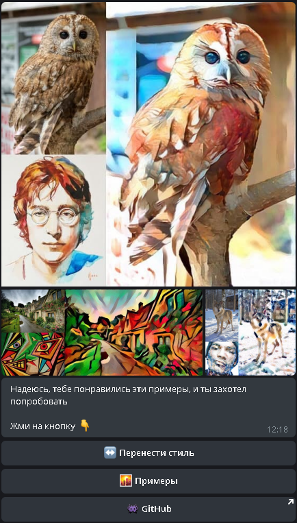

# <p align="center">Телеграм-бот для переноса стиля</p>
## <p align="center">Aiogram StyleTransfer Long polling Deploy</p>
||     Стартовый экран:        ||   Экран примеров:     ||     Вывод результата:  ||



1. My diploma project at MIPT Deep Learning School
- [1. My diploma project at MIPT Deep Learning School](#1-my-diploma-project-at-mipt-deep-learning-school)
  - [1.1. This is the introduction <a name="introduction"></a>](#11-this-is-the-introduction-)


```
python -m 

```

- as;ldkfj
- askldjf
  
$$x \not = sin^2(x)$$

`asdk` <br>
___
| asdfkj | askldjf;lk |
| --- | --- |
| asdkfjl| a;lksdjf|
|alskdjf;k| as;dkfj |

many random text<br>
many random text<br>
many random text<br>
many random text<br>
many random text<br>
many random text<br>
many random text<br>
many random text<br>
many random text<br>
many random text<br>
many random text<br>
many random text<br>
many random text<br>
many random text<br>
many random text<br>
many random text<br>
many random text<br>
many random text<br>
many random text<br>
many random text<br>
many random text<br>
many random text<br>
many random text<br>
many random text<br>
many random text<br>
many random text<br>
many random text<br>
many random text<br>
many random text<br>
many random text<br>
many random text<br>
many random text<br>
many random text<br>
many random text<br>
many random text<br>
many random text<br>
many random text<br>
many random text<br>
many random text<br>
many random text<br>
many random text<br>
many random text<br>
many random text<br>
many random text<br>
many random text<br>
many random text<br>
many random text<br>
many random text<br>
many random text<br>
many random text<br>
many random text<br>
many random text<br>
many random text<br>
many random text<br>
many random text<br>
many random text<br>
many random text<br>
many random text<br>
many random text<br>
many random text<br>
many random text<br>
many random text<br>
many random text<br>
many random text<br>
many random text<br>
many random text<br>
many random text<br>
many random text<br>
many random text<br>
many random text<br>
many random text<br>


_______________________
## 1.1. This is the introduction <a name="introduction"></a>
Some introduction text, formatted in heading 2 style
