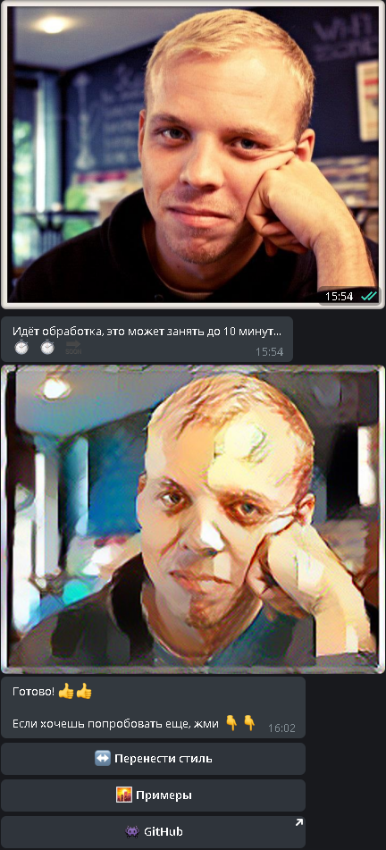

# 
Телеграм-бот для переноса стиля

**Оглавление**
1. [Описание проекта](#introduction)
2. [Внешний вид бота](#visual)
3. [Особенности реализации](#implementation)
4. [Deploy](#deploy)
5. [Структура проекта](#project_structure)
6. [TBD](#to_be_done)
   
## 
Описание проекта

Данный проект представляет собой телеграм-бота для переноса стиля с одного изображения на другое. 
Сам бот реализован на базе асинхронного фреймворка [aiogram](https://github.com/aiogram/aiogram) 
Для переноса стиля используется нейронная сетка, написанная на [Pytorch](https://pytorch.org/) 
В основе лежит [алгоритм](https://arxiv.org/abs/1508.06576), предложенный Леоном Гатисом в 2015 году

## 

Внешний вид бота. Основные экраны.

| Стартовый экран | Экран примеров | Вывод результата |
| --- | --- | --- |
|  |  |  |

## 
Особенности реализации

- Асинхронность. Поскольку использовался `aiogram` - весь интерфейс асинхронный.  Основная проблема была с тем, что обработка изображения - блокировала основной поток.  Поэтому был использован модуль `threading`. В асинхронную функцию были "завёртнуты" сама обработка изображения, создание временного бота, пересылка результата пользователю. Функция соответственно запускается в отдельном потоке с помощью `threading.Thread`. Таким образом бот не зависает в тот момент, когда обрабатывает изображения, может обрабатывать несколько параллельно и при этом "общаться" с пользователями.  
- Сохранение присланных изображения и контроль текущего состояния пользователя были реализованы через `Finite State Machine` и `MemoryStorage`.   
- Чтобы интерфейс бота был более удобным - использованы `Inline-клавиатуры`, а также иконки `emoji`.  
- Опять же для удобства использования сохранены 6 изображений стилей и пользователю предлагается либо выбрать кнопкой на inline-клавиатуре один из вариантов, либо прислать собственный.  
- Также реализована возможность просмотра результатов работы бота.  
- Сам алгоритм, предложенный Гатисом был реализован ориентируясь на [туториал](https://pytorch.org/tutorials/advanced/neural_style_tutorial.html) на сайте `Pytorch` 
Для удобного использования весь алгоритм реализован как класс. 
Дополнительно создан класс для предобработки присланных изображений. Поскольку их нужно приводить к одному размеру, но при этом не хочется терять соотношение сторон - изображения ресайзятся с добавлением паддинга. Для чего используется `ImageOps.pad` из библиотеки `Pillow`. Перед отправкой пользователю итоговое изображение ресайзится обратно до его исходного размера, также при помощи `ImageOps.fit`  
- В зависимости от наличия или отсутствия gpu на сервере, где запускается проект - выбирается ресайз до 256(cpu) и 512(gpu) пикселей.  
- Чтобы не грузить целиком VGG19, отдельно (в проекте в папке `models_wts` есть скрипт для просто для демонстрации) сохранена модель с первыми 11 слоями. Среди них 5 свёрточных и их хватает для применения алгоритма. Такая сеть "весит" всего 2.12 мб. 

## 
Deploy

## 
Структура проекта

- Основная идея структуры проекта "подсмотрена" у [Kostiantyn Kriuchkov](https://github.com/Latand/aiogram-bot-template)
- В папке `handlers` находятся все хэндлеры.
- В папке `images` находятся папки с изображениями стилей, описанием изображений, а также примерами работы и ещё 3 изображения для этого `readme`
- В папке `models` находится сам класс релизующий алгоритм Гатиса
- В папке `models_wts` лежит сохранённая модель из 11 слоёв от VGG19
- В папке `states` находится класс состояний для бота.
- В папке `utils` находятся дополнительные скрипты. В данный момент это скрипт назначения команд по-умолчанию для бота.
- В корне модуль `app` - запуск polling, и 2 функции запускающиеся при старте и остановке polling.
- В модуле `keyboards` - все клавиатуры.
- В модуле `loader` - создание самого бота, event_loop, хранилища и диспетчера.
- В модуле `text_messages` - основные сообщения бота.
- Файл `env.dist` - пример файла с токеном для бота и другими данными. При использовании в проекте - его нужно переименовать в .env и он используется через библиотеку `dotenv`
- Файл `readme.md` - то описание, которое вы сейчас читаете.
- Файл `requirements.txt` - список всех необходимых библиотек. Легко установить их все с помощью `pip -r requirements.txt`

## 
TBD

Что ещё планирую добавить и исправить:
- Раскидать все хэндлеры по отдельным модулям. Сейчас большая часть хэндлеров лежит в модуле `transfer`, там реализована основная логика общения пользователя с ботом.
- Добавить алгоритм Fast-NST
- Добавить CycleGan
- Поменять `long_polling` на `webhook`
